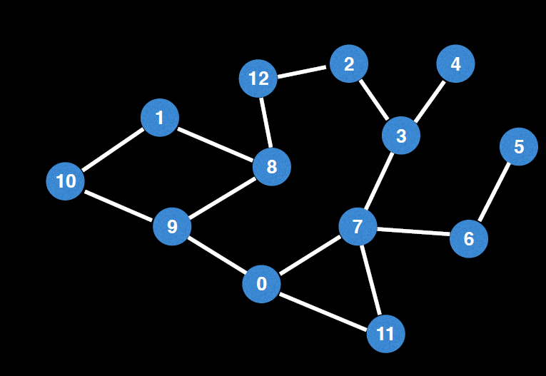

# Shortest path in a non-weighted graph
 
 
#### Question
Use BFS to print the shortest path between two nodes in a un-weighted graph
# Example 1:

```
Input: graph = 
0	->	[7,9,11],
1	->	[8,10],
2	->	[3,12],
3	->	[2, 4],
4	->	[3],
5	->	[6],
6	->	[5,7],
7	->	[0,3,6, 11],
8	->	[1,9,12],
9	->	[0,8,10]
10	->	[1,9],
11	->	[0,7],
12	->	[2,8]
s = 0
e = 12
Output: [0,9,8,12]
 ```
  
 # Example 2:

```
Input: graph = 
0	->	[7,9,11],
1	->	[8,10],
2	->	[3,12],
3	->	[2, 4],
4	->	[3],
5	->	[6],
6	->	[5,7],
7	->	[0,3,6, 11],
8	->	[1,9,12],
9	->	[0,8,10]
10	->	[1,9],
11	->	[0,7],
12	->	[2,8]
s = 10
e = 5
Output: [10,9,0,7,6,5]
```
 
# Solution
* BFS - https://codeinterview.io/QQVUICCBPO
