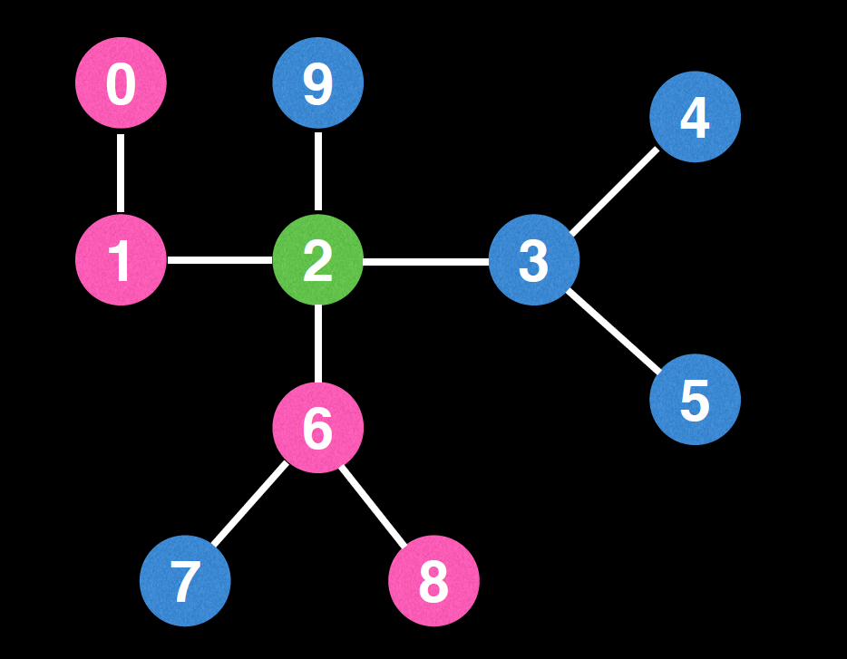
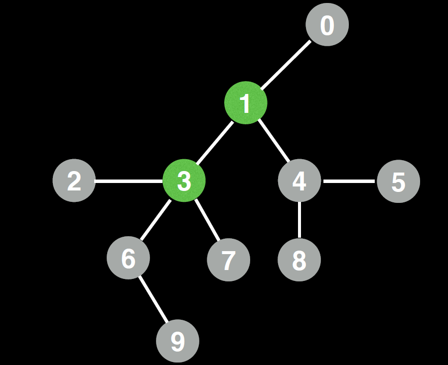

# Center(s) of an undirected tree
 
 
#### Question
An interesting problem when you have an undirected tree is finding the tree’s center node(s). 
This could come in handy if we wanted to select a good node to root our tree

Note: The center is always the middle vertex or middle two vertices in every longest path along the tree.
# Example 1:

 - Image courtesy: William Fiset
```
Output: 2
 ```
# Example 2:

 - Image courtesy: William Fiset
```
Output: 3, 1
 ```
# Solution
* DFS - https://codeinterview.io/HJKUEJZABL
