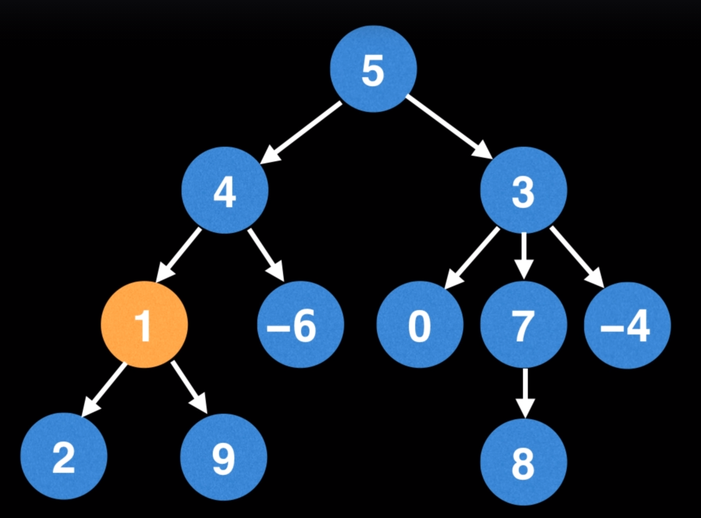

# Find the height of a tree
 
 
#### Question
Given a tree find its height. 
The height of a tree is the number of edges from the root to the lowest leaf
# Example 1:

 - Image courtesy: William Fiset
```
Output: 3
 ```
 
# Solution
* DFS - https://codeinterview.io/VQAOEITHPFs
