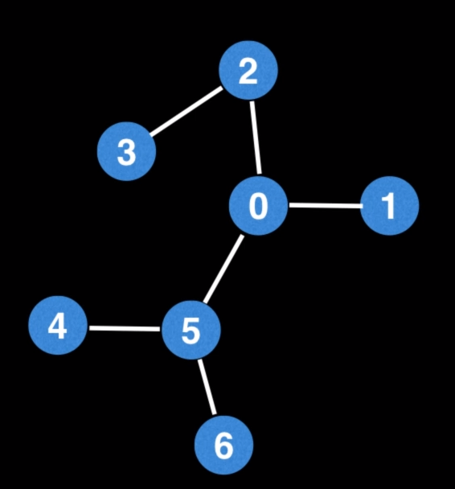

# Rooting a tree
 
 
#### Question
Given an undirected tree, **root** it at a given node and convert it into a rooted out tree.
Out tree is a directed tree where all edges point away from the root.
# Example 1:

 - Image courtesy: William Fiset
```
input:  
       0 -> [2,1,5],
       1 -> [0],
       2 -> [3,0],
       3 -> [2],
       4 -> [5],
       5 -> [4,6,0], 
       6 -> [5],
Output: [0, 2, 3, 1, 5, 4, 6]
 ```
 
# Solution
* DFS - https://codeinterview.io/HOXADWGJGO
