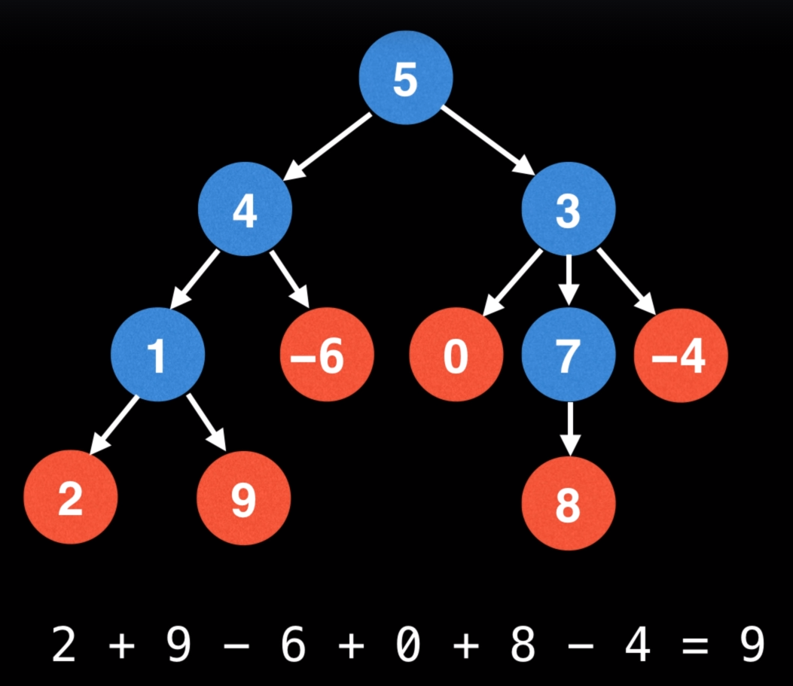

# Sum of leaf node values in a tree
 
 
#### Question
Given a tree that has integer node values, return the sum of all leaf nodes
# Example 1:

 - Image courtesy: William Fiset
```
Output: 9
 ```
 
# Solution
* DFS - https://codeinterview.io/SIQGRRNKOG
