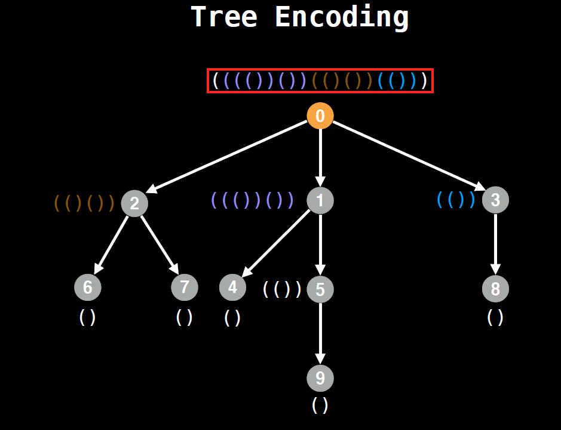

# Isomorphism in trees - Tree encoding
 
 
#### Tree Encoding Summary(AHU)

* Leaf nodes are assinged Knuth tuples '()' to begin with.
* Every time you move up a layer the labels of the previous subtrees get sorted lexicographically and wrapped in brackets
* You cannot process a node until you have processed all its children.


 - Image courtesy: William Fiset

# Example 1:

```
Input: isConnected = [[1,1,0],[1,1,0],[0,0,1]]
Output: 2
 ```
 
 # Example 2:

```
Input: isConnected = [[1,0,0],[0,1,0],[0,0,1]]
Output: 3
```
 
# Solution
* DFS - https://codeinterview.io/AJMGCZJKYS
