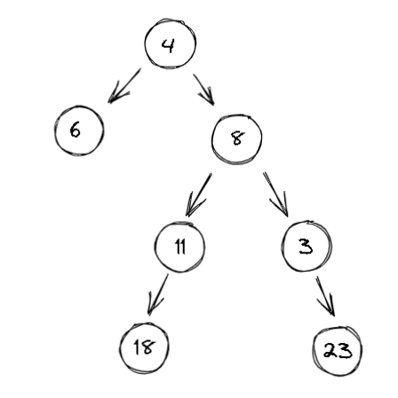

# 105. Construct Binary Tree from Preorder and Inorder Traversal
 
leetcode url: https://leetcode.com/problems/construct-binary-tree-from-preorder-and-inorder-traversal/

 
#### Question
Given two integer arrays preorder and inorder where preorder is the preorder traversal of a binary tree and inorder is the inorder traversal of the same tree, construct and return the binary tree.

# Example 1:

```
Input: preorder = [3,9,20,15,7], inorder = [9,3,15,20,7]
Output: [3,9,20,null,null,15,7]
 ```
 
# Example 2:

```
Input: preorder = [-1], inorder = [-1]
Output: [-1]
```
# Example 3:

```
Input: preorder = [4, 6, 8, 11, 18, 3, 23], inorder = [6, 4, 18, 11, 8, 3, 23]
Output: [4, 6, 8, null, null, 11, 3, 18, null, null, 23]
```

# Constraints:

```
* 1 <= preorder.length <= 3000
* inorder.length == preorder.length
* -3000 <= preorder[i], inorder[i] <= 3000
* preorder and inorder consist of unique values.
* Each value of inorder also appears in preorder.
* preorder is guaranteed to be the preorder traversal of the tree.
* inorder is guaranteed to be the inorder traversal of the tree.
 ```
 
# Solution
 * Recursive [ConstructBinTreeFromPreNIInorderTraversal](ConstructBinTreeFromPreNIInorderTraversal.cs)
